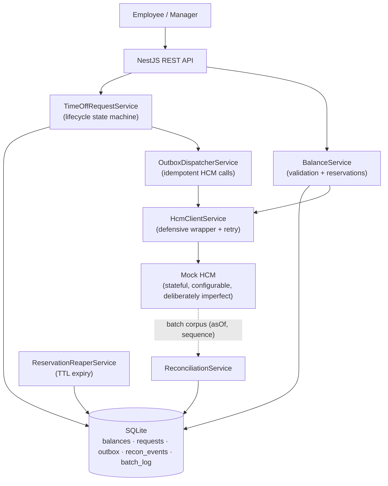

# Time-Off Microservice

[](./LICENSE)

This service manages the employee time-off request lifecycle — submit, approve, reject, cancel, expire — while keeping local leave balances reconciled with an upstream HCM system (Workday/SAP stand-in) that is the authoritative source of truth. The interesting design problem is not the lifecycle itself; it is **balance integrity across an at-least-once network against a source of truth that changes independently**. HCM can lower a balance between submit and approve (year-start refresh, anniversary bonus), can return HTTP 200 on an insufficient-balance write, and cannot be relied on to honour idempotency keys. The service handles all three: it re-fetches and re-validates at approve time rather than trusting a cached value, uses a transactional outbox so every HCM call survives a crash and is replayed exactly once, and reconciles local state against each batch snapshot by the time HCM actually applied the change — not by when the local commit landed — because those two instants can differ when the network is slow.

---

## Live demo

A working deployment of this service is reachable at **<https://ooo.cativo.dev>** (Hetzner / Traefik / Let's Encrypt). The root endpoint returns `{"status":"ok"}`; the full API surface is open for hands-on exploration with the included Postman collection.

```bash
curl https://ooo.cativo.dev/                                                            # {"status":"ok"}
curl https://ooo.cativo.dev/balance/emp1/loc1 -H 'X-Employee-Id: emp1' -H 'X-Role: employee'   # current balance (lazy-loaded from mock HCM)
```

The live stack runs the same `cativo23/wizdaa-takehome:latest` image built by CI; the mock HCM is bundled in-stack as the source-of-truth stand-in (in a real deployment the mock would be dropped and `HCM_BASE_URL` repointed). Deploy pipeline: GitHub Actions → Docker Hub → SSH to host → `docker compose pull && up -d` behind Traefik, with a `curl https://ooo.cativo.dev/` health gate. Full procedure: [`docs/DEPLOY.md`](docs/DEPLOY.md).

## Postman collection

A curated Postman collection lives in [`docs/postman/`](docs/postman/) with two environments and nine guided scenarios (happy path, idempotency, HCM-silent-insufficient, retry-cap REVERSE, divergent batch, cancel-after-file, expired-reservation, mid-flight balance refresh, manager-only transitions). Import into Postman:

| File | Use |
|------|-----|
| `Time-Off-Microservice.postman_collection.json` | The full collection (requests + tests + pre-request scripts) |
| `Time-Off-Microservice.postman_environment.json` | **Local** environment — `base_url=http://localhost:3000`, `hcm_url=http://localhost:3101` |
| `Time-Off-Microservice-Prod.postman_environment.json` | **Prod** environment — `base_url=https://ooo.cativo.dev` (HCM control surface is not exposed in prod) |

The collection's variables (`employee_id`, `location_id`, `request_id`, `idempotency_key`) are scoped to the environment, so switching between Local and Prod is a one-click swap.

---

## Quick start (Docker)

```bash
git clone <repo>
cd wizdaa-takehome
docker compose up --build -d
```

The service is ready when both containers are healthy (usually under 30 seconds):

```bash
docker compose ps        # both should show "healthy"
curl http://localhost:3000/
# {"status":"ok"}
```

**Port map:**

| URL | What |
|-----|------|
| `http://localhost:3000` | Time-off service (app) |
| `http://localhost:3101` | Mock HCM control surface |

The mock HCM container-internal port is 3001; it is mapped to host port **3101** because host port 3001 frequently conflicts with other local development services. The app reaches the mock over the Docker network as `http://mock-hcm:3001`, so the remapping is invisible to the service itself.

**Seed a balance for hands-on testing:**

```bash
curl -s -X POST http://localhost:3101/_control/refresh \
  -H 'Content-Type: application/json' \
  -d '{"employeeId":"emp1","locationId":"loc1","balance":20}' | jq
```

**Trigger a batch corpus push from the mock** (the mock pushes to the service's `POST /timeoff/hcm/batch` endpoint):

```bash
curl -s -X POST http://localhost:3101/_control/emit-batch \
  -H 'Content-Type: application/json' \
  -d '{"targetUrl":"http://localhost:3000/timeoff/hcm/batch","sequence":1}' | jq
```

**Switch HCM behaviour** — the mock supports seven configurable scenarios for manual testing:

```bash
# Make HCM return 200 even when balance is insufficient
curl -s -X POST http://localhost:3101/_control/scenario \
  -H 'Content-Type: application/json' \
  -d '{"scenario":"silent-insufficient"}' | jq

# Make HCM simulate a timeout on every call
curl -s -X POST http://localhost:3101/_control/scenario \
  -H 'Content-Type: application/json' \
  -d '{"scenario":"timeout"}' | jq

# Reset to normal
curl -s -X POST http://localhost:3101/_control/scenario \
  -H 'Content-Type: application/json' \
  -d '{"scenario":"correct"}' | jq
```

Other scenarios: `mutate-between-calls` (balance drops mid-approve), `divergent-batch` (batch value differs from realtime), `duplicate-delivery`, `ignore-idempotency-key`.

**Postman collection** — import both files and run the *Guided Scenarios → A. Happy path* folder for a complete lifecycle walk:

```
docs/postman/Time-Off-Microservice.postman_collection.json
docs/postman/Time-Off-Microservice.postman_environment.json
```

---

## Architecture



Five actors mutate a balance: the approve path, the outbox dispatcher, the reconciliation service, the reservation reaper, and the retry worker inside the dispatcher. **All five serialise on a single per-balance-key lock** (`BalanceLockService.runExclusive`, ADR-010). The lock is keyed on `(employeeId, locationId)`, so unrelated balances run fully concurrently. Every failure mode catalogued in TRD §13 is, at bottom, some actor skipping that lock: the reaper racing the dispatcher, a reconcile interleaving with a retry, or a cancel landing mid-commit. The lock is the single point that closes all of them.

NestJS modules: `BalanceModule`, `TimeOffRequestModule`, `HcmModule` (client + outbox dispatcher), `ReconciliationModule`, `ReservationReaperModule`, `MockHcmModule`.

### Request state machine

```
DRAFT ──submit──▶ PENDING ──approve [GET HCM → re-validate → commit → enqueue FILE]
                    │              ├─ HCM ok → FILE acked ──▶ APPROVED
                    │              ├─ HCM down ────────────▶ PENDING_SYNC ──retry ok──▶ APPROVED
                    │              │                                        └─retry cap──▶ [REVERSE] ──▶ REJECTED
                    │              └─ insufficient ─────────▶ REJECTED
                    ├─reject ──────▶ REJECTED
                    └─TTL reaper ──▶ EXPIRED  [void pending FILE in same txn]
PENDING_SYNC ──cancel──▶ CANCELLED  [void pending FILE, or REVERSE if SENT]
APPROVED     ──cancel──▶ CANCELLED  [restore + enqueue REVERSE]
```

Balance effects by transition: submit `reserved += days`; approve-commit `available -= days, reserved -= days`; reject/expire `reserved -= days`; cancel-approved `available += days`. Terminal transitions that may have already filed to HCM (retry-cap REJECTED, PENDING_SYNC cancel) enqueue a REVERSE rather than adjusting locally, because a FILE may have landed at HCM despite the apparent failure.

---

## Key design decisions

The full ADR set is in `docs/TRD.md §7`. What follows is the load-bearing subset a reviewer needs to understand the tradeoff surface.

### Reserve-on-submit with TTL reaper (ADR-002)

Submit moves days from `available` to `reserved`, giving an instant local validation result without calling HCM. Approve commits the reservation (`available -= days, reserved -= days`); reject or expire releases it (`reserved -= days`). Each reservation carries an `expiresAt` timestamp (default 14 days, configurable via `RESERVATION_TTL_DAYS`). The reaper sweeps expired PENDING and PENDING_SYNC requests on a five-minute schedule, and in the **same transaction** it voids any still-PENDING outbox FILE row for that request — without that co-ordination, the dispatcher could file to HCM after the reservation was released, producing a deduction with no corresponding local request.

### Transactional outbox (ADR-011 + ADR-013)

Approve writes the state change and an `Outbox` row in one local SQLite transaction. The outbox dispatcher polls PENDING rows, calls HCM, marks them SENT, and records `hcmAckAt` on the request. On crash and restart, unsent rows are redriven. The key constraint is that the balance write, the request write, and the outbox insert must all commit atomically — two transactions re-opens the crash window the outbox is meant to close. `BalanceService` mutators accept an optional `EntityManager` so the caller's transaction encloses all three writes (ADR-013). An external broker (BullMQ, SQS) would re-introduce the dual-write problem: the DB commit and the broker publish are not one transaction.

### Reconcile by `hcmAckAt`, not `committedAt` (ADR-003)

Batch ingest sets the local `available` to the HCM snapshot value, then replays every local effect that the snapshot cannot yet reflect. The replay cutoff was changed in the v3 review: a request whose local commit landed before the snapshot `asOf` but whose HCM acknowledgement (`hcmAckAt`) landed after `asOf` is in neither the snapshot base nor any naive `committedAt`-based replay — the deduction would be lost. The correct cutoff is `hcmAckAt IS NULL OR hcmAckAt > asOf`. Both fields are on `TimeOffRequest`; `hcmAckAt` is set by the outbox dispatcher when HCM acknowledges the FILE or REVERSE call.

### Pure outbox approve flow

Approve never calls HCM synchronously inside the request handler. It refreshes the HCM balance (ADR-001 step 1), re-validates locally, commits the reservation, and enqueues a FILE row in the outbox — then returns either APPROVED (if the dispatcher later confirms) or PENDING_SYNC (if HCM is unavailable). The dispatcher promotes PENDING_SYNC to APPROVED on the FILE acknowledgement. On reaching the retry cap, it enqueues a compensating REVERSE and moves the request to REJECTED once that REVERSE is acknowledged, so the HCM deduction (if one landed despite the timeout) is unwound.

### One per-balance-key lock for five actors (ADR-010)

The earlier design named only approve, retry, and reconciliation as lock holders. The v3 review found that the outbox dispatcher and the reaper also mutate balance state and were racing the others. The fix brought all five under the same `BalanceLockService.runExclusive` call. The lock uses an in-process async mutex keyed on `(employeeId, locationId)`. It is correct because the topology is single-writer; on the Postgres upgrade path (§11) it is replaced by `SELECT ... FOR UPDATE` row locks.

### Cold-read lazy hydration (ADR-014)

A freshly provisioned `(employeeId, locationId)` tuple has `available: 0, lastHcmAsOf: null` until a batch corpus arrives. That zero-balance causes every submit to be rejected for insufficient balance, even when HCM holds a real value. On `GET /balances`, when `lastHcmAsOf` is null, the service acquires the balance-key lock, re-checks under the lock (double-checked locking to prevent stampede on the same key), calls HCM once, and routes the result through the existing `applyHcmSnapshot` path. If HCM is unavailable, nothing is persisted — the response carries `degraded: true` and the next request retries the bootstrap. Gated by `BALANCE_LAZY_LOAD_ENABLED` (default `true`).

### Duplicate and overlapping requests (ADR-012)

Three distinct shapes of duplicate submission require different handling. A double-click of the same form reuses the client-minted `Idempotency-Key` header; the server returns the existing request without creating a second one or touching the reservation. Two distinct requests for overlapping or boundary-touching dates (January 2–3 and January 3–4 share January 3) are caught by the inclusive overlap predicate `newStart <= existingEnd AND newEnd >= existingStart` evaluated under the per-key lock — the second request is rejected with a conflict message, never silently trimmed. Two distinct requests for disjoint dates both pass the overlap check; the balance guard then decides whether the second can be reserved. All three checks run under the per-key lock (ADR-010), so two simultaneous submits serialise and the second sees the first.

### Scaling boundary (TRD §11)

The single-writer SQLite topology is deliberate, not a gap. Under any single-writer topology — plain SQLite, LiteFS, rqlite, Turso — writes are serialised by the writer and no distributed lock is needed. Horizontal scale forks to either (a) SQLite → Postgres with the in-process lock → `SELECT ... FOR UPDATE`, or (b) replicated SQLite with leader-election-as-coordination. The design documents where it breaks rather than adding infrastructure the assignment does not exercise.

---

## Test rigor

Test rigor is the primary grading dimension in the assignment brief. Numbers first.

### Unit and component-integration suite

**87 tests across 10 suites** — run with `npm test`.

Per-service statement coverage:

| Service file | Stmts |
|---|---|
| `balance.service.ts` | 96% |
| `hcm-client.service.ts` | 100% |
| `outbox-dispatcher.service.ts` | 96% |
| `reconciliation.service.ts` | 100% |
| `reservation-reaper.service.ts` | 96% |
| `time-off-request.service.ts` | 93% |

The harness (§9.1 of the TRD) is where the rigor lives:

- **Isolation**: each test gets a fresh `:memory:` SQLite database; migrations run in `beforeEach`, so no test leaks state.
- **FakeHcmClient**: a stateful in-process test double that implements seven configurable scenarios — `correct`, `silent-insufficient`, `timeout`, `mutate-between-calls`, `divergent-batch`, `duplicate-delivery`, `ignore-idempotency-key`. Switching scenarios per-test makes the defensive paths deterministic rather than probabilistic.
- **Deterministic concurrency**: `BalanceLockService.installLatch` injects a release handle into the critical section. A test holds operation A inside the lock, fires operation B, asserts B is blocked, releases A, then asserts the post-A state. This makes E2/E12/E21/E22 (concurrent submit, retry-during-reconcile, concurrent disjoint) deterministic without sleeps or timing loops.
- **Injectable clock**: `FakeClock` replaces `SystemClock` via the `CLOCK` DI token. `clock.advance(ms)` fast-forwards time, making TTL expiry (E15) and timezone/DST boundary cases (E18) testable without waiting.

The suite covers the full E1–E28 edge-case matrix from TRD §9.2. A representative selection of what those cases exercise:

- **E3** — HCM returns 200 on an insufficient-balance write; local guard rejects regardless.
- **E10** — HCM balance drops between submit and approve (year-start refresh); approve re-fetches, re-validates, rejects, releases reservation.
- **E14** — Approval committed before batch `asOf` but HCM-acked after; replay includes it (`hcmAckAt > asOf`), deduction not lost.
- **E15** — Reservation past TTL; reaper voids the pending FILE outbox row in the same transaction so no post-expiry filing occurs.
- **E24** — Reaper expires a PENDING_SYNC request while a FILE is in flight; outbox row voided in same transaction, no post-expiry HCM call.
- **E25** — Retry-cap REJECTED after a FILE already landed at HCM; compensating REVERSE undoes the deduction, no under-count.
- **E26** — Batch reconciliation drives `available` negative; `needsReview` is set and a `ReconciliationEvent(FLAGGED_NEGATIVE)` is emitted; manager can resolve.

### HTTP-integration suite (supertest)

**44 tests across 6 spec files** — run with `npm run test:e2e`.

The layer boots the real `AppModule` (minus `ScheduleModule`) in-process with a real `MockHcmModule` on an ephemeral port for the network-behaviour specs. Scheduler decorators are inert; tests drive `dispatchPending` and `sweep` manually. Each test gets a fresh `:memory:` database. The six spec files and their coverage areas:

| Spec file | Tests | Area |
|---|---|---|
| `lifecycle.e2e-spec.ts` | 8 | Submit → approve → cancel happy paths; balance arithmetic end-to-end |
| `auth-idor.e2e-spec.ts` | 12 | Every header edge; IDOR prevention; role enforcement |
| `validation-pipe.e2e-spec.ts` | 8 | `class-validator` rules; `whitelist: true` stripping; `ParseUUIDPipe` |
| `serialization.e2e-spec.ts` | 6 | Response JSON shape; `degraded` field; `committedAt` lifecycle |
| `batch-ingest.e2e-spec.ts` | 4 | Corpus ingestion; stale-sequence rejection; `needsReview` flag |
| `hcm-network.e2e-spec.ts` | 6 | Real `HcmClientService` retry budget; latency budgets; idempotency over the wire |

The `hcm-network` spec uses `withLatencyBudget` assertions to lock down two bugs caught by the curl smoke: a cold-read deadlock that produced a 31-second hang (now must complete in under 2,000 ms), and an approve-under-HCM-down hang (PENDING_SYNC path must respond in under 2,000 ms). Once the real `HcmClientService` retry budget is exercised, a warm cache read with HCM unavailable must complete in under 100 ms — the cached path must not block on the network at all. Idempotency-Key deduplication is verified end-to-end: the dispatcher calls HCM twice with the same key, the mock's idempotency store deduplicates, and the HCM balance decrements exactly once.

### Deployment smoke

`scripts/e2e-smoke.sh` runs over 100 curl scenarios against the live Docker stack. It is the deployment gate, not the PR gate — it takes roughly three minutes and requires a running stack. It covers Docker port mapping, container healthcheck wiring, and the `compose.yml` environment variable plumbing that the in-process supertest layer cannot reach.

### CI pipeline

`.github/workflows/ci.yml` runs four jobs on every push and PR against `main`/`master`:

1. **Lint** — `npm run lint`
2. **Unit tests + coverage** — `npm run test:cov`; enforces a 70% statement coverage floor on `All files` (per-service is 93–100%; the aggregate is pulled down by thin controllers and the mock HCM module, which are intentionally lightly covered); uploads the lcov report as a build artefact (retained 14 days)
3. **E2E tests** — `npm run test:e2e`; depends on the unit job passing first
4. **Build** — `nest build`; verifies `dist/main.js` and `dist/mock-hcm/main.js` are both produced

Concurrency is configured with `cancel-in-progress: true` per ref, so a rapid push does not queue redundant runs. Node 22 is pinned in all jobs; the runtime is Node 24 (matching `@types/node: ^24.0.0`), which is fully compatible.

---

## The agentic development story

The assignment PDF states that no single line of code should be hand-written. The commit history is the evidence trail.

The build proceeded in clearly delineated phases. The contract-freeze commit (`fb22931`) locked every interface, token, method signature, and module wiring before any implementation began — the `CONTRACTS.md` in this repo is that artefact. Implementation agents then filled service bodies against the frozen contract in two phases: core services first (`dd15655`, `126720d`), then workers and API wiring (`f8d8780`). A dedicated test harness pass built the FakeHcmClient, the latch seam, and the in-memory module (`87a0ac3`) before a second pass wrote the 44-test E1–E28 matrix (`f8d8780`).

What makes the commit graph honest is the review loop. The v3 TRD changelog (`docs/TRD.md §14`) lists the specific bugs each review wave found: the `committedAt`-vs-`hcmAckAt` lost-deduction seam (ADR-003), the dispatcher and reaper excluded from the balance-key lock (ADR-010), the stranded-reservation race (ADR-002), the two-transaction atomicity gap (ADR-013). Those findings produced fix commits (`dd15655`, ADR-013 and ADR-014 additions) and a new ADR rather than silent code changes — the architectural record grew because reviewers found gaps, not because the design was complete at v1.

Three later commits follow the same pattern: `986340e` (fast-fail option on read-path HCM calls, after a latency bug hunt), `3a9413c` (cold-cache re-entrancy deadlock, caught by the e2e smoke before the supertest layer existed), and `df9af9a` (IDOR on cancel, `X-Powered-By` header leak, DTO `MaxLength` caps — all from a security review pass). The supertest suite (`112e4e7`) was built to lock down the bugs those review waves found, so they cannot silently regress.

The coverage gap-fill commit (`1870e43`) was produced specifically to push `hcm-client.service.ts` and `time-off-request.service.ts` back above the 90% threshold after a review identified uncovered branches. That commit exists because the coverage report is a proof artefact, not because coverage-chasing was the goal — the same review wave that flagged the gap also verified the underlying logic was correct.

The workflow discipline that produced this commit graph — contract-freeze before any implementation, planning agents separate from implementation agents, dedicated review passes that produce findings rather than silent fixes, fix agents that commit against those findings and update the TRD — is the same discipline that produced the 14-ADR document. ADR-013 and ADR-014 did not exist at v1; they were written because implementation review found a two-transaction atomicity gap and a cold-read UX failure. The ADR count is a byproduct of the review loop, not an upfront architecture exercise.

---

## Repository layout

```
.
├── src/
│   ├── balance/           -- BalanceService + controller + DTOs
│   ├── common/
│   │   ├── clock/         -- Clock interface, SystemClock, FakeClock, CLOCK token
│   │   └── lock/          -- BalanceLockService (per-key mutex + latch seam)
│   ├── config/            -- AppConfigService (typed env vars)
│   ├── database/          -- TypeORM DataSource + buildDataSourceOptions helper
│   ├── entities/          -- All five entities + enums (shared, read-only)
│   ├── hcm/               -- HcmClientService, OutboxDispatcherService, HCM_CLIENT token
│   ├── health/            -- GET / health endpoint
│   ├── mock-hcm/          -- Standalone mock HCM service (ADR-007)
│   ├── reconciliation/    -- ReconciliationService + BatchController
│   ├── reservation-reaper/-- ReservationReaperService (TTL sweep)
│   ├── testing/           -- FakeHcmClient, FakeClock, createTestModule, latch helpers
│   └── time-off-request/  -- TimeOffRequestService + controller + DTOs
├── test/
│   ├── e2e-helpers/       -- bootstrapTestApp, bootstrapMockHcm, withLatencyBudget
│   ├── lifecycle.e2e-spec.ts
│   ├── auth-idor.e2e-spec.ts
│   ├── validation-pipe.e2e-spec.ts
│   ├── serialization.e2e-spec.ts
│   ├── batch-ingest.e2e-spec.ts
│   └── hcm-network.e2e-spec.ts
├── docs/
│   ├── TRD.md             -- Technical Requirements Document, 14 ADRs, v3.2
│   ├── CONTRACTS.md       -- Frozen interface spec used by the agentic build
│   ├── E2E-DESIGN.md      -- Supertest layer design doc
│   ├── DEPLOY-POLARIS2.md -- Deployment plan for the demo server
│   └── postman/           -- Postman collection + environment + guided scenarios
├── scripts/
│   └── e2e-smoke.sh       -- curl-based deployment smoke (100+ scenarios)
├── .github/
│   └── workflows/
│       └── ci.yml         -- Lint + unit + e2e + build pipeline
├── compose.yml            -- Production-like Docker stack (app + mock HCM)
└── Dockerfile             -- Multi-stage build; runtime target used by compose
```

---

## Documentation index

| Document | Purpose |
|---|---|
| `docs/TRD.md` | Technical Requirements Document — problem statement, functional requirements, domain model, 14 ADRs, edge-case matrix E1–E28, v3.2 |
| `docs/CONTRACTS.md` | Frozen interface spec: file tree, entity schemas, DI tokens, all service method signatures with ADR references — the agentic build contract |
| `docs/E2E-DESIGN.md` | Supertest layer design: two-app boot architecture, per-file test catalogue, latency-budget helper, per-failure mapping from the curl smoke |
| `docs/postman/` | Postman collection + environment file + guided scenario walkthroughs (import both files) |
| `HANDOFF.md` | Build-status document from the agentic phases (historical context) |
| `docs/DEPLOY-POLARIS2.md` | Deployment plan for the demo server (Traefik + Docker Compose on Ubuntu 24.04) |

---

## Configuration / environment

All values come from environment variables; defaults apply when a variable is absent.

| Variable | Default | Purpose |
|---|---|---|
| `DATABASE_PATH` | `/app/data/timeoff.sqlite` | Path to the SQLite database file; use `:memory:` in tests |
| `HCM_BASE_URL` | `http://localhost:3001` | Base URL of the HCM service; in Docker stack, `http://mock-hcm:3001` |
| `RESERVATION_TTL_DAYS` | `14` | Days before an un-actioned PENDING reservation expires (ADR-002) |
| `HCM_RETRY_MAX_ATTEMPTS` | `5` | Maximum HCM call attempts before the PENDING_SYNC path caps and compensates (ADR-004) |
| `HCM_RETRY_BACKOFF_MS` | `1000` | Exponential backoff base in milliseconds for HCM retries (ADR-004) |
| `BALANCE_LAZY_LOAD_ENABLED` | `true` | Enables cold-read lazy hydration from HCM on first `GET /balances` for a new `(employeeId, locationId)` tuple (ADR-014); set to `false` to disable and return zeroes until a batch arrives |

---

## Local development (without Docker)

```bash
npm install
npm run start:dev     # NestJS in watch mode, port 3000; HCM_BASE_URL defaults to http://localhost:3001
```

You need the mock HCM running separately if you want real HCM calls:

```bash
# In a second terminal
HCM_SCENARIO=correct node dist/mock-hcm/main.js   # after npm run build
# or: npx ts-node src/mock-hcm/main.ts             # without building
```

Available npm scripts:

| Script | Purpose |
|---|---|
| `npm run build` | Compile TypeScript; produces `dist/main.js` and `dist/mock-hcm/main.js` |
| `npm run start:dev` | NestJS watch mode |
| `npm test` | Jest unit + component-integration suite (87 tests) |
| `npm run test:cov` | Same with Istanbul coverage report |
| `npm run test:e2e` | Supertest HTTP-integration suite (44 tests) |
| `npm run lint` | ESLint with Prettier |
| `bash scripts/e2e-smoke.sh` | curl smoke against a live Docker stack |

---

## Stack

| Layer | Choice | Version |
|---|---|---|
| Framework | NestJS | 11 |
| Language | TypeScript | 5.7 |
| ORM | TypeORM | 1.0 (API-compatible with 0.3.x) |
| Database | better-sqlite3 | 12.10 |
| HTTP client | `@nestjs/axios` + axios | 4.0 / 1.16 |
| Scheduler | `@nestjs/schedule` | 6.1 |
| Validation | class-validator + class-transformer | 0.15 / 0.5 |
| Test runner | Jest | 30 |
| HTTP testing | supertest | 7.0 |
| Runtime | Node.js | 22 (CI) / 24 (types) |

TypeORM 1.0.0 in `package.json` is behaviourally identical to 0.3.x; it uses `DataSource`, `Repository`, `@VersionColumn`, and `forRootAsync` — the standard 0.3.x API. The deprecated 0.2.x `createConnection` pattern is not used anywhere.

---

## API at a glance

Auth headers are injected by the upstream gateway on every request; this service trusts them (TRD A4, §12).

| Header | Values | Required on |
|---|---|---|
| `X-Employee-Id` | trusted employee ID | all routes |
| `X-Role` | `employee` or `manager` | all routes |
| `Idempotency-Key` | client-minted UUID v4 | `POST /time-off-requests` only |

| Method | Path | Role | Returns | Notes |
|---|---|---|---|---|
| `GET` | `/` | any | `{ status: 'ok' }` | Health check |
| `GET` | `/balances` | any | `Balance` | Query: `?employeeId=&locationId=`; employee may only read own balance |
| `PATCH` | `/balances/resolve-review` | manager | `{ ok: true }` | Clears `needsReview` after manual resolution (ADR-003/B4) |
| `POST` | `/time-off-requests` | employee | `TimeOffRequest` 201 | Submit; `days` is server-computed, never client-supplied |
| `POST` | `/time-off-requests/:id/approve` | manager | `TimeOffRequest` 201 | Refetches HCM balance, re-validates, enqueues FILE (ADR-001) |
| `POST` | `/time-off-requests/:id/reject` | manager | `TimeOffRequest` 201 | Releases reservation |
| `POST` | `/time-off-requests/:id/cancel` | employee / manager | `TimeOffRequest` 201 | Restores balance, enqueues REVERSE if already filed (ADR-004) |
| `POST` | `/timeoff/hcm/batch` | service token (future) | `{ accepted: true }` 202 | Full corpus push `{ asOf, sequence, balances[] }` (ADR-009) |

---

## Production hardening caveats

These are explicit scope decisions, not oversights:

**Auth depth is delegated upstream.** The service authorises every operation against the `X-Employee-Id` and `X-Role` headers injected by the gateway (IDOR checks are enforced: an employee cannot read or mutate another employee's balance). It does not implement its own JWT validation — that is the gateway's responsibility (TRD A4).

**`POST /timeoff/hcm/batch` is unauthenticated by design.** In production this endpoint would be protected by mTLS or a service token from the gateway. The TRD §12 notes this; the mock setup does not simulate it.

**SQLite at rest is unencrypted.** The demo carries no PHI. In a production deployment with real employee data, `sqlcipher` or filesystem-level encryption would apply.

**No rate limiting at this layer.** Rate limiting is the gateway's responsibility; `@nestjs/throttler` is a one-decorator addition if defence-in-depth at the service boundary is required.

**Single-writer topology is deliberate.** See the §11 scaling fork in `docs/TRD.md`: the upgrade path is SQLite → Postgres (in-process lock → `SELECT ... FOR UPDATE`) or replicated SQLite (LiteFS/rqlite). The in-process `BalanceLockService` is correct only for single-writer; that constraint is documented, not hidden.

---

## License

MIT License — Copyright 2026 Carlos Cativo.
