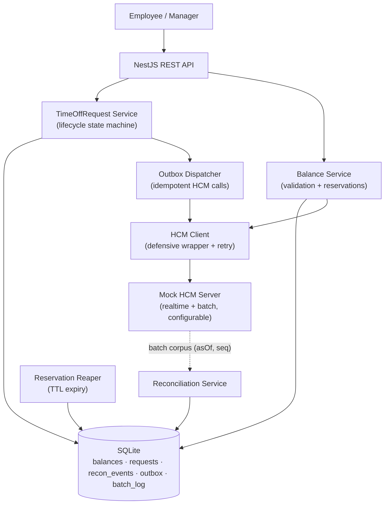

# Technical Requirements Document — Time-Off Microservice

**Status:** v3 (folds a 4-lens review: architecture, adversarial, spec-compliance, editorial — see §13)
**Author:** Carlos Cativo
**Stack:** NestJS + SQLite (mandated)
**Date:** 2026-05-27

---

## 1. Problem Statement

ExampleHR is the employee-facing interface for requesting time off. The HCM system (Workday/SAP) is the
**source of truth** for balances. This service manages the request lifecycle while keeping local balances
reconciled with HCM, even though three things make that hard:

1. HCM balances change independently of ExampleHR (work-anniversary bonuses, year-start refresh — which can
   *lower* a balance, not only raise it).
2. HCM exposes a realtime API (get/send one balance) and a batch endpoint (full corpus push).
3. HCM does not reliably return errors for invalid dimensions or insufficient balance. We treat its error
   responses as a hint, never a guarantee.

Balances are keyed per-employee per-location `(employeeId, locationId)`.

The service reaches an unreliable source of truth over an **at-least-once** network. That drives the core
design rule: every state-changing call to HCM must be idempotent, and every local effect must be reconcilable
against an authoritative snapshot **by the time HCM actually applied it** — not by when we committed locally.

## 2. Goals & Non-Goals

**Goals**
- Manage the request lifecycle with balance integrity: no double-spend, no lost deduction, no negative-from-approved.
- Reconcile local balances with HCM through the realtime and batch paths, safely under concurrency.
- Stay defensive against unreliable HCM error reporting and at-least-once delivery.
- Give the employee fast, accurate feedback and the manager valid data.

**Non-Goals**
- Authn/authz depth. An upstream gateway injects `employeeId` and role.
- UI / frontend.
- Real Workday/SAP integration. HCM is mocked with configurable behaviors.

## 2.1 Assumptions

The assignment leaves HCM and the surrounding systems underspecified. These are the assumptions the design
rests on; each would be confirmed with the HCM team before implementation, and several are configurable.

| # | Assumption | If wrong |
|---|------------|----------|
| A1 | HCM pushes the batch corpus (we don't poll), periodically and/or on events like year-start; each push carries a monotonic `sequence` and an `asOf` | Add a scheduled pull and a cursor; ADR-009 sequence logic is unchanged |
| A2 | The batch corpus is a **full snapshot** of all balances as of `asOf`, not a delta | Delta semantics would change ADR-003 from "set base" to "apply delta" |
| A3 | HCM accepts an `Idempotency-Key` on writes; if it ignores the key, our local guard still holds (tested via the mock toggle) | No change — the design already assumes HCM may ignore it |
| A4 | An upstream gateway authenticates and injects a trusted `employeeId` + role | Add auth middleware; does not affect the balance logic |
| A5 | Balances are whole-day; one leave-balance type per `(employeeId, locationId)`. No partial-day or multi-category (vacation vs sick) in v1 | Multi-type adds a `leaveType` dimension to the key and balance |
| A6 | Each `locationId` maps to a known timezone and a business-day calendar (weekends + holidays) available as reference data | Without it, `days` and date-boundary logic can't be computed; would need a calendar service |
| A7 | Date ranges are inclusive `[start, end]` and a request is a contiguous range | Non-contiguous selections would be modeled as multiple requests |
| A8 | HCM errors, when returned, mean invalid dimensions or insufficient balance — not a rich taxonomy | A richer taxonomy would map to more specific rejections |
| A9 | Single-writer topology for the mandated SQLite stack (§11); HCM recovers within the retry window, else we compensate and alert | Multi-writer follows the §11 upgrade fork |
| A10 | Reservation TTL default 14 days; retry cap and backoff are configurable business policy | Tune via config; no code change |

## 3. Functional Requirements

| ID | Requirement |
|----|-------------|
| FR-1 | View current available + reserved balance for `(employeeId, locationId)` |
| FR-2 | Submit a time-off request (date range → business days) |
| FR-3 | Instant local validation feedback at submit |
| FR-4 | Manager approve/reject a pending request |
| FR-5 | Approval files time-off against HCM (idempotent) and commits the deduction |
| FR-6 | Cancel an approved request; balance restored, reversal filed to HCM (idempotent) |
| FR-7 | Ingest HCM realtime balance updates |
| FR-8 | Ingest HCM batch corpus (`asOf` + sequence) and reconcile |
| FR-9 | Detect, log, and resolve local↔HCM divergence (ReconciliationEvent + balance review flag) |
| FR-10 | Auto-expire stale reservations (PENDING past TTL → release) |

## 4. Non-Functional Requirements

| ID | Requirement | How it's met |
|----|-------------|--------------|
| NFR-1 | Balance integrity: no double-spend, no lost deduction, no negative-from-approved | Reserve-on-submit, local primary guard, reconcile-by-HCM-ack-time (ADR-001/002/003) |
| NFR-2 | Defensive validation: never rely solely on HCM errors | Local re-validation at every gate (ADR-001) |
| NFR-3 | End-to-end idempotency: duplicate submits and duplicate HCM calls don't double-apply | Inbound key + HCM-contract idempotency keys (ADR-008/012) |
| NFR-4 | Observability: reconciliation and HCM outcomes auditable | ReconciliationEvent, Outbox, structured HCM logs |
| NFR-5 | Testability: configurable mock HCM, deterministic concurrency tests, high coverage | Mock HCM (ADR-007), Test Architecture (§9.1) |
| NFR-6 | Responsiveness: employee feedback isn't blocked on HCM | Local validation at submit; HCM confirm deferred to approve (ADR-001) |
| NFR-7 | Crash durability: no stranded reservation, no lost HCM call | Transactional outbox (ADR-011) |

---

## 5. Architecture



Five components mutate balance state: the approve path, the retry worker, the reconciliation service, the
outbox dispatcher, and the reservation reaper. **All five serialize on the per-balance-key lock** (ADR-010).
Every failure mode in §13 is, at bottom, some version of one of those actors skipping that lock.

**NestJS modules:** `BalanceModule`, `TimeOffRequestModule`, `HcmModule` (client + outbox dispatcher),
`ReconciliationModule`, `ReservationReaperModule`, `MockHcmModule`.

## 6. Domain Model

```
Balance
  employeeId    string   ┐ composite PK
  locationId    string   ┘
  available     integer  -- days free to request
  reserved      integer  -- days held by PENDING / PENDING_SYNC
  needsReview   boolean  -- set when reconciliation produces a negative (ADR-003 / B4)
  version       integer  -- optimistic lock (ADR-005)
  lastHcmAsOf   datetime -- asOf of the last authoritative HCM value applied

TimeOffRequest
  id              uuid PK
  employeeId      string
  locationId      string
  startDate       date          -- inclusive, interpreted in location timezone
  endDate         date          -- inclusive
  days            integer       -- business days via location calendar
  status          enum (DRAFT|PENDING|PENDING_SYNC|APPROVED|REJECTED|CANCELLED|EXPIRED)
  idempotencyKey  string unique -- inbound dedup (active-state scoped, ADR-012)
  hcmIdempotencyKey string      -- stable key reused across all HCM calls for this request
  expiresAt       datetime      -- reservation TTL (ADR-002)
  version         integer
  committedAt     datetime null -- when the local deduction committed (audit)
  hcmAckAt        datetime null -- when HCM acknowledged the file/reverse (drives reconcile, ADR-003)
  createdAt       datetime
  updatedAt       datetime

Outbox                          -- transactional outbox (ADR-011)
  id            uuid PK
  aggregateId   uuid            -- requestId
  operation     enum (FILE|REVERSE)
  payload       json
  idempotencyKey string         -- request.hcmIdempotencyKey + operation
  status        enum (PENDING|SENT|FAILED|VOIDED)
  attempts      integer
  createdAt     datetime

BatchSyncLog                    -- idempotent batch ingest (ADR-009)
  sequence      integer PK      -- monotonic; reject <= last applied
  asOf          datetime
  appliedAt     datetime

ReconciliationEvent
  id          uuid PK
  employeeId  string
  locationId  string
  localValue  integer
  hcmValue    integer
  resolution  enum (REPLAYED|FLAGGED_NEGATIVE|NO_CHANGE|STALE_REJECTED)
  createdAt   datetime
```

**Request state machine:**

```
DRAFT ─submit─▶ PENDING ─approve [refresh HCM → re-validate → enqueue FILE]
                  │                    ├─ HCM ok ──────▶ APPROVED
                  │                    ├─ HCM down ────▶ PENDING_SYNC ─retry ok─▶ APPROVED
                  │                    │                              └─retry cap─▶ [enqueue REVERSE] ─▶ REJECTED
                  │                    └─ insufficient ▶ REJECTED
                  ├─reject / invalid──▶ REJECTED
                  └─TTL (reaper)──────▶ EXPIRED            [void pending FILE in same txn]
PENDING_SYNC ─cancel─▶ CANCELLED                           [void pending FILE, or REVERSE if SENT]
APPROVED     ─cancel─▶ CANCELLED                           [restore + enqueue REVERSE]
```

A reconciliation that drives `available` negative does **not** add a request state; it sets
`Balance.needsReview = true` and emits `ReconciliationEvent(FLAGGED_NEGATIVE)`. A manager resolution endpoint
clears the flag once corrected. This keeps the divergent-balance case observable and recoverable instead of
silently negative (B4).

**Balance effects:** submit `reserved+=days`; approve `available-=days, reserved-=days, committedAt=now`;
reject/expire `reserved-=days`; cancel `available+=days`. Terminal transitions that may have already filed to
HCM (retry-cap REJECTED, PENDING_SYNC cancel) enqueue a REVERSE rather than silently adjusting locally (B3).

---

## 7. Architectural Decisions (ADRs)

### ADR-001 — Defense-in-depth validation, with an explicit approve sequence
**Status:** Accepted
**Context:** HCM is the source of truth but it is slow to call and its error responses can't be trusted. A
year-start refresh can lower a balance between submit and approve, so a stale local cache could approve over a
real balance.
**Decision:** Validate locally at submit for instant feedback (against a possibly-stale cache, acceptable for
feedback only). At approval, run an ordered sequence: (1) HCM realtime `GET`; (2) write the result to the
local cache under the version lock and set `lastHcmAsOf`; (3) re-validate against the just-updated cache;
(4) enqueue the idempotent FILE via the outbox (ADR-011). Local validation is the primary guard; HCM
confirmation is additive and never the sole gate.
**Alternatives:** Trust-HCM is slow and unsafe given unreliable errors; trust-local drifts and approves on
stale data.
**Consequences:** Integrity holds at the committing step and survives an HCM 200-on-insufficient, for the
price of a second validation path and one HCM read per approve.

### ADR-002 — Reserve-on-submit, with reservation TTL
**Status:** Accepted
**Context:** Concurrent pendings could over-commit a balance, and an un-actioned PENDING would otherwise hold
`reserved` days forever and re-flag every reconcile.
**Decision:** Submit moves days `available→reserved`; approve commits, reject/expire releases. Each reservation
carries `expiresAt` (configurable TTL, default 14 days). A scheduled reaper sweeps expired PENDING/PENDING_SYNC
to EXPIRED and releases `reserved`. The reaper runs under the balance-key lock and, in the **same transaction**,
voids any still-PENDING outbox FILE row for that request — otherwise the dispatcher could file to HCM after the
reservation was released (B2).
**Day semantics:** `days` = business days from the location calendar (weekends + holiday set). Partial-day
leave is out of scope for v1. Ranges are inclusive `[start, end]` and interpreted in the location timezone.
**Alternatives:** Deduct-on-approve races on concurrent pendings; no TTL strands reservations.
**Consequences:** No over-commit, no stranded holds, and nothing files after a reservation is released. The
price is a reaper job and a dependency on the location calendar.

### ADR-003 — Batch reconciliation: HCM base + replay by HCM-ack time
**Status:** Accepted (revised in v3)
**Context:** A batch is a snapshot taken at HCM time `asOf` and ingested later. The earlier design replayed
local effects by `committedAt`, but the outbox files to HCM **asynchronously** — an approval committed before
`asOf` may not have reached HCM until after `asOf`, so it would be in neither the snapshot base nor the replay.
That loses a deduction. The value that decides snapshot membership is *when HCM applied the change*, not when
we committed locally.
**Decision:** After the ordering checks (ADR-009), set base `available` = HCM value, then re-apply every local
effect that the snapshot cannot yet reflect: any request whose `hcmAckAt` is null OR `> asOf`, plus outstanding
reservations, plus pending REVERSEs (symmetric to FILEs). If the result is negative, set `Balance.needsReview`
and emit `ReconciliationEvent(FLAGGED_NEGATIVE)` for manager resolution rather than leaving a silent negative.
Reconciliation holds the balance-key lock for the whole read-modify-write, so it cannot interleave with the
dispatcher, retry worker, reaper, or a cancel (ADR-010).
**Alternatives:** Replay by `committedAt` (loses the commit-before-ack-after window); replay reservations only
(loses committed deductions); HCM-wins-hard (drops in-flight work silently).
**Consequences:** No double-count, no lost deduction across the realtime/batch boundary. Cost: track `hcmAckAt`
and reconcile in-flight REVERSEs as well as FILEs.

### ADR-004 — HCM failure: queue-and-retry (PENDING_SYNC), idempotent + compensating
**Status:** Accepted (revised in v3)
**Context:** HCM may be down at approve. A naive retry can double-file on timeout-then-retry, and a retry that
hits its cap can under-count if an earlier attempt actually succeeded at HCM.
**Decision:** On local-valid-but-HCM-unconfirmed, move to PENDING_SYNC (reservation held) and retry the FILE via
the outbox with backoff, reusing `hcmIdempotencyKey` so at-least-once delivery applies exactly once (ADR-008).
On success → APPROVED. On reaching the retry cap → enqueue a **REVERSE** (idempotent: a no-op at HCM if no FILE
ever landed, an undo if one did) and then → REJECTED once the reverse is acknowledged. The retry worker acquires
the balance-key lock before any state transition (ADR-010).
**Alternatives:** Fail-closed blocks all approvals during an HCM outage; fail-open commits before confirmation;
silent release on retry-cap under-counts when a FILE already succeeded.
**Consequences:** Non-blocking, exactly-once, and correct even when a late FILE landed. Cost: a compensating
REVERSE on the terminal path.

### ADR-005 — Optimistic locking via version column
**Status:** Accepted
**Decision:** `version` on `Balance`/`TimeOffRequest`; check-and-increment, retry on conflict. SQLite serializes
writes globally, so this documents the production-portable mechanism.
**Alternatives:** Pessimistic row locks add contention without benefit at this scale; no version control risks
lost updates under the future multi-writer topology.

### ADR-006 — REST over GraphQL
**Status:** Accepted
**Decision:** REST. NestJS-idiomatic, a clearer contract at the HCM boundary, simpler to mock.
**Alternatives:** GraphQL offers client-driven field selection and a single endpoint, but it adds schema and
resolver overhead the API surface here doesn't need (a handful of lifecycle and balance operations), and it
complicates the HCM mock contract. Not worth it for this scope.

### ADR-007 — Mock HCM as a stateful, networked, deliberately-imperfect test double
**Status:** Accepted
**Context:** The spec asks for a real mock server with logic to simulate balance changes. The service exists to
be defensive against an unreliable HCM, so a perfect HCM would leave the defensive paths untested.
**Decision:** Build a standalone NestJS service (`mock-hcm:3001`) with its own in-memory balance store keyed by
`(employeeId, locationId)`, seeded at startup. It exposes `GET /hcm/balance`, idempotent `POST /hcm/timeoff` and
`POST /hcm/timeoff/reverse`, and pushes batch corpus to the service. A `HCM_SCENARIO` env plus a live
`POST /_control/scenario` endpoint switch its behavior: `correct`, `silent-insufficient` (200 when it should
error), `timeout`, `mutate-between-calls`, `divergent-batch`, `duplicate-delivery`, `ignore-idempotency-key`.
A `POST /_control/refresh` injects a work-anniversary bonus or year-start refresh on demand, making the
balance-dropped-mid-flight case deterministic (E10).
**Alternatives:** A thin stub can't simulate balance changes and can't drive E6/E7/E10. A full production-grade
HCM doubles the build surface, and a correct HCM cannot exercise the defensive logic (E3/E10/E11) the service is
built for. The middle tier is a test harness, deliberately kept minimal.
**Consequences:** Realistic service-to-service integration with deterministic control of every failure mode the
matrix needs. Cost: a second small service to maintain.

### ADR-008 — Idempotency keys on the HCM contract
**Status:** Accepted
**Context:** HCM is reached over an at-least-once retry path. Auth→capture without idempotent capture
double-spends at the source of truth.
**Decision:** Every outbound FILE/REVERSE carries a stable `Idempotency-Key` (`hcmIdempotencyKey` + operation),
reused across all retries of the same logical operation. The mock HCM dedups on it, and a toggle lets us test
the case where HCM ignores it, proving the local guard still holds.
**Alternatives:** An internal-only dedup leaves the outbound call at-least-once and double-applies at HCM; no
key means retries and replays corrupt the source of truth.
**Consequences:** Retries and replays apply once at HCM; cancel reversal is idempotent. Cost: a stable key
allocated at request creation and persisted.

### ADR-009 — Batch `asOf` + monotonic sequence; reject stale/out-of-order
**Status:** Accepted
**Context:** A re-delivered or out-of-order batch would silently rewind state.
**Decision:** The batch payload carries `{ asOf, sequence, balances[] }`. `BatchSyncLog` records the last applied
`sequence`; ingest rejects any batch with `sequence <= last` (logged `STALE_REJECTED`). `asOf` drives the replay
cutoff in ADR-003.
**Alternatives:** Trusting delivery order assumes an exactly-once, ordered channel HCM doesn't promise.
**Consequences:** Duplicate and out-of-order batches are safe. Cost: HCM must supply a sequence (the mock does).

### ADR-010 — One balance-key lock for all five concurrent actors
**Status:** Accepted (revised in v3)
**Context:** Several components mutate the same balance: approve, retry worker, reconciliation, outbox dispatcher,
and reservation reaper. The earlier design only named approve/retry/reconcile, which let the dispatcher and
reaper race the others (B2).
**Decision:** Every mutation to a `(employeeId, locationId)` balance — including the dispatcher's state
transitions on FILE/REVERSE outcomes and the reaper's expiry — serializes on a per-key lock. The lock is per-key,
not global, to preserve throughput.
**Scope note:** the in-process lock is correct *because the topology is single-writer*. On the Postgres upgrade
path (§11), it is replaced by DB row locks (`SELECT … FOR UPDATE`); the lock upgrades together with the database.
**Alternatives:** Locking only a subset of actors leaves the seams that produced the reaper/dispatcher races; a
global lock serializes unrelated balances.
**Consequences:** The reconcile/retry/reaper/dispatcher races close. Cost: every balance actor must take the lock.

### ADR-011 — Transactional outbox for reserve-then-file durability
**Status:** Accepted
**Context:** Reserve-then-file spans a local DB write and an HCM HTTP call, not one transaction. A crash between
them would strand a reservation with no in-flight record.
**Decision:** In one local transaction, write the state change and an `Outbox` row describing the idempotent HCM
call. A dispatcher sends PENDING rows, marks them SENT, and records `hcmAckAt` on the request; on crash/restart it
redrives unsent rows. The reaper can VOID a row it supersedes (ADR-002).
**Alternatives:** Direct HCM calls inside the request flow lose the call on crash and couple latency to HCM.
**Consequences:** Durable and crash-safe with exactly-once net effect. Cost: an outbox table and a dispatcher loop.

### ADR-012 — Duplicate & overlapping request handling
**Status:** Accepted
**Context:** Rapid repeat submissions take three shapes that need different handling: a double-click of the same
request, two requests for the same or boundary-touching dates, and two requests for disjoint dates. Idempotency
answers "is this the same request"; it does not answer "can this person book these days twice."
**Decision:** Three guards, evaluated in order at submit.
**① Idempotency key — a fast-path, not the integrity guarantee.** The client mints a UUID v4 once per form
session and sends it on every click as `Idempotency-Key`. A double-click reuses it, so the server returns the
existing request. The same key with a different body is a client bug → 422. The key lives on
`TimeOffRequest.idempotencyKey UNIQUE`, **scoped to active states**: a key whose request reached a terminal state
(EXPIRED/REJECTED/CANCELLED) does not block a fresh resubmit (L1). A double-click short-circuits here and never
reaches ② or ③.
*Storage:* the unique constraint is the dedup; no separate store is needed at this scale. Redis with `SETEX` TTL
is the production path for a high-volume dedicated layer, deliberately not used here — the constraint suffices on
the mandated stack, and the permanent integrity guards are ② and ③ plus the balance check, which don't depend on
key retention.
**② Overlap invariant — the permanent guard for distinct submissions.** For different-key requests, reject any
whose range overlaps a non-terminal request for the same `(employeeId, locationId)`, using the inclusive interval
predicate `newStart <= existingEnd AND newEnd >= existingStart`. Boundary-touch (Jan 2–3 then Jan 3–4 sharing
Jan 3) is a conflict. The whole second request is rejected with a conflict message, never silently trimmed.
**③ Atomicity.** ①–③ and the insert run under the per-key lock (ADR-010), so two near-simultaneous submits
serialize and the second sees the first. SQLite's global write serialization makes this safe here; the production
guard is the lock, or a Postgres `EXCLUDE` range constraint.
Disjoint dates pass ② and are both allowed; the balance gate (ADR-002/005) then decides, rejecting the second for
insufficient balance rather than overlap.
**Alternatives:** Idempotency alone misses different-key/same-date duplicates; exact-match dedup misses boundary
overlap; partial-accept silently mutates intent.
**Consequences:** Correct under double-click, boundary-touch, and concurrent disjoint requests. Cost: an overlap
query per submit under the lock.

---

## 8. HCM Interface Contract (mocked)

| Endpoint | Direction | Idempotency | Purpose |
|----------|-----------|-------------|---------|
| `GET /hcm/balance?employeeId&locationId` | Service → HCM | n/a (read) | Realtime balance |
| `POST /hcm/timeoff` | Service → HCM | `Idempotency-Key` | File a time-off |
| `POST /hcm/timeoff/reverse` | Service → HCM | `Idempotency-Key` | Reverse on cancel/compensate |
| `POST /timeoff/hcm/batch` | HCM → Service | `sequence` (monotonic) | Full corpus push `{asOf, sequence, balances[]}` |

## 9. Test Strategy

Test rigor is the primary deliverable. Layers: Unit (balance math, transition guards, version retry),
Integration (lifecycle on in-memory SQLite), Contract/Mock-HCM (each scenario toggle), Edge cases (matrix below).

### 9.1 Test Architecture

How the suite is actually built. The rigor is in the harness, not only the case list:

- **Isolation:** each test gets a fresh `:memory:` SQLite database; migrations run in `beforeEach`, so no test
  leaks state into another. A balance/request factory seeds fixtures.
- **Mock HCM:** instantiated as a Nest testing module (in-process) for integration tests and as the real
  `mock-hcm` service for contract tests. Behavior is switched per test through `POST /_control/scenario`, so
  silent-insufficient, timeout, and mutate-between-calls are reproducible.
- **Forcing concurrency deterministically** (the hard part): the balance-key lock exposes a test seam — a
  release latch injected at the critical section. A test holds request A inside the lock, fires request B,
  asserts B is blocked, then releases A and asserts the post-A state. Where a seam isn't needed, `Promise.all([
  submit(A), submit(B)])` plus a barrier reproduces the race. This makes E2/E12/E21/E22 deterministic rather
  than timing-dependent.
- **Time control:** `expiresAt` and approve-time "is startDate past" use an injectable clock, so TTL expiry
  (E15) and timezone/DST cases (E18) are tested without waiting or flaking.
- **Coverage:** `jest --coverage`, ≥ 90% on services, the report committed as the proof artifact.

### 9.2 Edge-case matrix

| # | Scenario | Expected |
|---|----------|----------|
| E1 | Submit exceeding available | Rejected at submit, no reservation |
| E2 | Two concurrent submits, only one fits | One PENDING, one rejected, no over-commit |
| E3 | HCM silent failure (200 on insufficient) | Local guard rejects regardless of HCM 200 |
| E4 | HCM timeout at approve | → PENDING_SYNC, reservation held, retried |
| E5 | PENDING_SYNC retry hits cap | REVERSE enqueued, → REJECTED, reservation released, alert |
| E6 | Batch corpus < local mid-pending | base=HCM asOf, in-flight effects replayed, negative flagged |
| E7 | Batch corpus > local (anniversary bonus) | available increases, pendings intact |
| E8 | Duplicate submit (same idempotency key) | Single request, no double reservation |
| E9 | Cancel approved request | available restored, REVERSE filed once |
| E10 | Approve after HCM refresh dropped balance | Approve refetches HCM, re-validates, rejects, releases |
| E11 | HCM file times out, then retries | Filed exactly once (idempotency key) — ADR-008 |
| E12 | Retry worker succeeds during batch reconcile | No lost deduction (balance-key lock) — ADR-010 |
| E13 | Stale / out-of-order batch (`sequence ≤ last`) | Rejected, no state change — ADR-009 |
| E14 | Approval acked by HCM after snapshot `asOf` | Replayed (`hcmAckAt > asOf`), not lost — ADR-003 |
| E15 | Reservation past TTL | → EXPIRED, reserved released, pending FILE voided — ADR-002 |
| E16 | Double cancel (same request) | Reversal applied once (idempotent) — ADR-008 |
| E17 | Crash after local commit, before HCM file | Outbox redrives on restart, filed once — ADR-011 |
| E18 | startDate retroactive at approve (location tz / DST) | Evaluated in location-tz civil date, rejected if past |
| E19 | Two submits, same dates, different keys | Second rejected by overlap invariant — ADR-012 |
| E20 | Boundary touch: Jan 2–3 then Jan 3–4 | Second rejected on shared Jan 3 (inclusive) — ADR-012 |
| E21 | Concurrent disjoint dates, balance fits both | Both PENDING, cumulative reservation — ADR-002/010 |
| E22 | Concurrent disjoint dates, balance fits one | First reserved, second rejected for insufficient balance |
| E23 | Same key, different body (client bug) | 422 idempotency-key-reuse, no new request — ADR-012 |
| E24 | Reaper expires PENDING_SYNC with FILE in flight | Outbox row voided in same txn, no post-expiry file — ADR-002/B2 |
| E25 | Retry-cap REJECTED after a FILE already landed | REVERSE undoes the HCM deduction, no under-count — ADR-004/B3 |
| E26 | Reconcile drives available negative | `needsReview` set, FLAGGED_NEGATIVE event, manager can resolve — B4 |
| E27 | Cancel a PENDING_SYNC request | → CANCELLED, pending FILE voided or REVERSE enqueued — B4 |
| E28 | Resubmit after EXPIRE with same form key | New request created (key scoped to active states) — L1 |

## 10. Concurrency & Timing

- **Per-balance-key serialization** across all five balance actors (ADR-010); optimistic `version` locking
  elsewhere (ADR-005).
- **Reconcile-by-HCM-ack-time:** `hcmAckAt` versus `asOf` decides what the snapshot already reflects, keeping
  the realtime and batch paths from double-applying or losing a deduction (ADR-003).
- **Timestamps stored UTC.** All date-boundary logic — inclusive range membership, TTL expiry, and "is startDate
  in the past" — is computed by first converting to the **location-tz civil date**, never by raw UTC instant
  subtraction. This avoids the DST and midnight-boundary skew between `expiresAt` and the approve-time past-check.
- **Ranges are inclusive `[start, end]`.** Jan 2–3 means {Jan 2, Jan 3} = 2 days. The overlap predicate and the
  `days` business-day count share this convention, so boundary-touching ranges collide on the shared day.

## 11. Deployment Topology & Scaling Boundary

The service is a microservice by bounded context, its own datastore, a network API, and independent
deployability — not by replica count. It integrates with HCM as a separate distributed system. That boundary,
covering idempotency, reconciliation, the outbox, and eventual consistency, is the actual distributed-systems
problem here, and it doesn't change with instance count.

The stateful core is single-writer. The mandated SQLite allows one writer with many concurrent readers (WAL).
Even the distributed-SQLite layers — LiteFS, rqlite, Turso/libSQL — keep single-primary semantics: replicas
serve reads, writes funnel through one leader. So the binding constraint is *single-writer*, not *single-instance*.

This is why there's no distributed lock. A distributed lock serializes multiple concurrent writers sharing one
store. Under any single-writer topology, plain or replicated, writes are already serialized by the writer, and
the leader election is itself the coordination. An external lock would be redundant. Redis-style locking earns
its place only with a stateless multi-writer tier, which this service is not.

**Horizontal-scale upgrade path, a fork:**
- **(a) Networked RDBMS** — SQLite → Postgres, and the in-process lock → DB row locks (`SELECT … FOR UPDATE`) or
  an `EXCLUDE` range constraint for the overlap invariant.
- **(b) Replicated SQLite** — LiteFS/rqlite/Turso: multi-instance reads, single leader serializing writes, with
  no Postgres and no external lock.

Both keep write-serialization intact. I'd rather mark where the design breaks than build for scale the
assignment never exercises.

## 12. Security & Authorization

Auth *depth* is delegated to the upstream gateway (A4), but the service still owns several security
responsibilities at its own boundary:

- **Authorization / IDOR prevention.** The gateway injects a trusted `employeeId` and role. The service
  authorizes every operation against it: an employee may only read, submit, or cancel for their **own**
  `employeeId`; a request whose target `(employeeId, locationId)` does not match the authenticated principal
  is rejected (403), so employee A can never read or mutate employee B's balance. Manager-only transitions
  (approve/reject) require the `manager` role and are scoped to requests the manager is authorized over.
- **Input validation at the boundary.** Every request body and query is validated with `class-validator`
  DTOs: well-formed IDs, valid ISO dates, `endDate >= startDate`, bounded range length. **`days` is always
  recomputed server-side** from the date range and the location calendar — a client-supplied day count is
  never trusted.
- **Test-only control surface.** The mock HCM's `_control/*` scenario endpoints live in `MockHcmModule`,
  which is never imported into the production service build. In a real deployment the `mock-hcm` service is
  dropped and `HCM_BASE_URL` points at the real HCM, so the control surface cannot be reached.
- **Replay & abuse.** The idempotency key collapses duplicate submits; the overlap invariant blocks
  double-booking; per-principal submit throttling (gateway-assisted) limits abuse. The outbox + HCM
  idempotency key make retries safe to replay without double-applying.
- **Secrets & transport.** HTTPS terminates at the gateway in production; HCM credentials come from the
  environment / a secrets manager, never source. Logs carry IDs only — no balances, names, or other PII at
  info level.

## 13. Risks

| Risk | Mitigation |
|------|------------|
| Double-spend at HCM via retries | Idempotency keys on the HCM contract (ADR-008), E11/E16 |
| Lost deduction across realtime/batch boundary | Reconcile by `hcmAckAt`, not `committedAt` (ADR-003), E14 |
| Reaper/dispatcher race after expiry | All five actors under one lock; reaper voids outbox in-txn (ADR-002/010), E24 |
| Under-count on retry-cap after a FILE landed | Compensating REVERSE on the terminal path (ADR-004), E25 |
| Silent negative balance after reconcile | `needsReview` flag + manager resolution (ADR-003), E26 |
| Double-count on stale batch | `asOf` cutoff + sequence guard (ADR-003/009), E13 |
| Stranded reservation on crash or inaction | Outbox redrive (ADR-011) + TTL reaper (ADR-002), E15/E17 |
| HCM silent failure approves invalid | Local primary guard (ADR-001), E3 |
| Timezone/DST date bugs | Location-tz civil-date comparison (§10), E18 |
| Double-click / duplicate-date booking | Idempotency key + inclusive overlap + per-key lock (ADR-012), E8/E19/E20 |

## 14. Changelog

- **v3** — Folded a 4-lens review (architecture, adversarial, spec-compliance, editorial). Fixed the
  `committedAt`-vs-`asOf` lost-deduction seam by reconciling on `hcmAckAt` (ADR-003); brought the outbox
  dispatcher and reaper under the balance-key lock (ADR-010) and made the reaper void in-flight outbox rows
  (ADR-002); made the retry-cap terminal path compensate with a REVERSE (ADR-004); added the negative-balance
  review flag and the PENDING_SYNC cancel transition (B4); scoped the inbound idempotency key to active states
  (ADR-012); added a Test Architecture subsection (§9.1) and edge cases E24–E28; added `Alternatives` to
  ADR-005/006/008/009/010/011; location-tz civil-date comparison (§10). Added §2.1 Assumptions and §12
  Security & Authorization (final-gate findings). Editorial voice pass.
- **v2** — Added ADR-008 to ADR-012 (HCM idempotency, batch sequence, interlock, outbox, duplicate/overlap),
  reservation TTL, explicit approve sequence, §10/§11. Edge cases E11–E23.
- **v1** — Initial four decisions: defense-in-depth, reserve-on-submit, HCM-base reconcile, queue-and-retry.

## 15. Deliverables Checklist

- [ ] This TRD
- [ ] NestJS + SQLite service implementing §5–§8 (built via agentic development)
- [ ] Standalone configurable mock HCM (ADR-007)
- [ ] Test suite covering the §9.2 matrix (E1–E28) with the §9.1 harness
- [ ] Coverage report (proof, ≥ 90% on services)
- [ ] README: setup + run, architecture summary, decisions rationale
